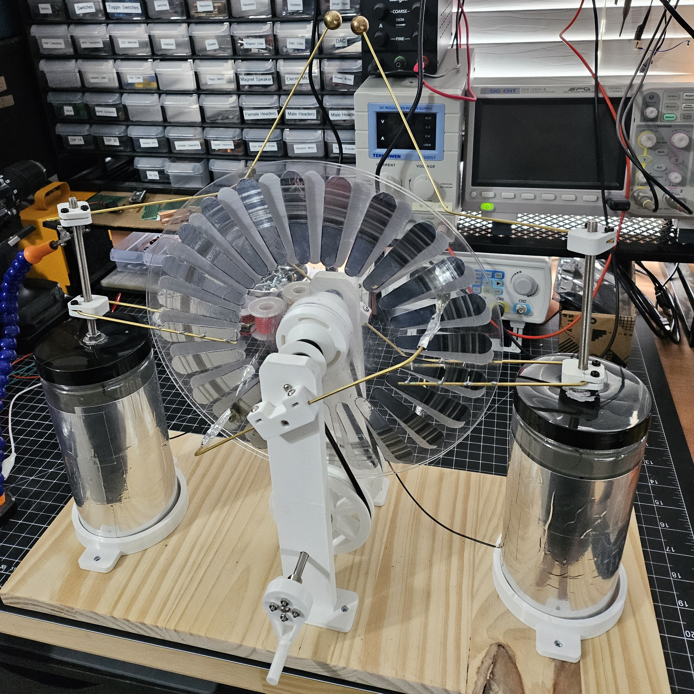

# wimshurst-machine

A Wimshurst machine with a 6 pack of Leyden jars.

I had trouble recording it, but the best I could get was a half inch spark gap.
1 inch spark gap is about 30kV, so I guess I generated about 15kV.
I wish I could get a better spark gap, but I'm satisfied enough with the result and ready to move on.

## Parts List

- 2x [10 inch clear acrylic disc](https://www.amazon.com/gp/product/B09WB37JMC/)
- 6x [606 bearing](https://www.amazon.com/gp/product/B07FDZWK76)
- 2x [15mm brass bearing](https://www.amazon.com/gp/product/B0B5XKQNMR)
- 2x [M6 threaded rod](https://www.amazon.com/gp/product/B08FQR9CJW)
- 2x [M6 304 stainless steel rod](https://www.amazon.com/gp/product/B082ZNXYMG)
- 3x [6mm flange coupling conector](https://www.amazon.com/gp/product/B08334N261)
- 4x [2mm brass rod](https://www.amazon.com/gp/product/B087JYWMF9)
- 1x [4mm polyurethane belt](https://www.amazon.com/gp/product/B0BM3SCL12)
- 2x [Salwater leyden jars](https://github.com/barrettotte/bytes/tree/master/electrostatics/leyden-jar)
- 8x [Flat head #4 x 1/2"](https://www.amazon.com/gp/product/B08RW9BLG3)
- [3mm nylon bolts and nuts](https://www.amazon.com/gp/product/B076J5RGKS)
- [Aluminum foil tape](https://www.amazon.com/gp/product/B0BF3NGVDZ)
- 8" x 20" wood board
- 3D printed parts
  - 4x [cad/collector-mount.stl](cad/collector-mount.stl)
  - 2x [cad/disk-pulley.stl](cad/disk-pulley.stl)
  - 1x [cad/disk-spacer.stl](cad/disk-spacer.stl)
  - 2x [cad/drive-pulley.stl](cad/drive-pulley.stl)
  - 1x [cad/electrode-template.stl](cad/electrode-template.stl)
  - 1x [cad/hand-crank.stl](cad/hand-crank.stl)
  - 2x [cad/leyden-jar-mount.stl](cad/leyden-jar-mount.stl)
  - 2x [cad/neutralizer-v2.stl](cad/neutralizer-v2.stl)
  - 2x [cad/support-bottom.stl](cad/support-bottom.stl)
  - 2x [cad/support-top.stl](cad/support-top.stl)

## Build Notes

This project got away from me...I meant to write down each step as I built it. 
But, building this took longer than I expected and I got distracted by other projects.
So, this next part is not very helpful.

I used mainly M3 nylon bolts and nuts to prevent charge from leaking out.
Unfortunately, I was not smart enough to actually write down the bolt lengths I used and they are not really reflected in my design. 
I need to get better about adding this type of stuff to my Fusion 360 projects.

For each support, I press fit a [606 bearing](https://www.amazon.com/gp/product/B07FDZWK76) 
into [cad/support-bottom.stl](cad/support-bottom.stl) and [cad/support-top.stl](cad/support-top.stl).
Then I superglued them together.

For each disk, I used a [10 inch clear acrylic disc](https://www.amazon.com/gp/product/B09WB37JMC/) and drilled a 6mm hole in the center.
I used [cad/electrode-template.stl](cad/electrode-template.stl) to trace an outline for 24 electrodes on aluminum foil tape.
Then I positioned them equally around the disk using a protractor.

The axles were cut from [M6 304 stainless steel rod](https://www.amazon.com/gp/product/B082ZNXYMG).
The top axle is ~13mm and the bottom axle is ~20mm.

For each disk pulley, I press fit a [606 bearing](https://www.amazon.com/gp/product/B07FDZWK76) into [cad/disk-pulley.stl](cad/disk-pulley.stl) 
and super glued it to a disk. Each [cad/disk-pulley.stl](cad/disk-pulley.stl) is mounted to the top axle.

The drive belts are made from [4mm Polyurethane belt](https://www.amazon.com/gp/product/B0BM3SCL12).
I cut them to size (forgot to record this) and used a soldering iron to re-weld the belts.
One belt has a twist in it, to ensure the belts rotate in opposite directions.

For each drive pulley, I mounted it to the bottom axle using a [6mm flange coupling conector](https://www.amazon.com/gp/product/B08334N261).
The belts are setup between each [cad/disk-pulley.stl](cad/disk-pulley.stl) and [cad/drive-pulley.stl](cad/drive-pulley.stl).

The [cad/hand-crank.stl](cad/hand-crank.stl) is fixed to the bottom axle 
using a [6mm flange coupling conector](https://www.amazon.com/gp/product/B08334N261).

For each collector, I bent [2mm brass rod](https://www.amazon.com/gp/product/B087JYWMF9) in a U shape 
and soldered small spikes of wire pointing inside. 
This bent rod gets clamped into [cad/collector-mount.stl](cad/collector-mount.stl) using nylon bolts and nuts.

For each neutralizer, I bent [2mm brass rod](https://www.amazon.com/gp/product/B087JYWMF9) and clamped it into
[cad/neutralizer-v2.stl](cad/neutralizer-v2.stl) using nylon bolts and nuts.
Then I taped stranded wire to each end of the neutralizer using aluminum foil tape.

For each electrode, I bent [2mm brass rod](https://www.amazon.com/gp/product/B087JYWMF9) and clamped it into
[cad/neutralizer-v2.stl](cad/neutralizer-v2.stl) using nylon bolts and nuts.
I drilled a ~2mm partial hole into each [15mm brass bearing](https://www.amazon.com/gp/product/B0B5XKQNMR) and
super glued it to the end of the bent rod.

For each leyden jar, I built a saltwater leyden jar using my instructions 
in [bytes/electrostatics/leyden-jar](https://github.com/barrettotte/bytes/tree/master/electrostatics/leyden-jar).
To ensure position, the leyden jar is placed in a [cad/leyden-jar-mount.stl](cad/leyden-jar-mount.stl).
A wire is also connected between each leyden jar on the outside foil.

## Related

Other things I made while building the Wimshurst machine.

- [Electrophorus](https://github.com/barrettotte/bytes/tree/master/electrostatics/electrophorus)
- [Electroscope](https://github.com/barrettotte/bytes/tree/master/electrostatics/electroscope)
- [Leyden Jar](https://github.com/barrettotte/bytes/tree/master/electrostatics/leyden-jar)

## References

- [History of Electrostatic Generators](http://www.hp-gramatke.net/history/english/page4000.htm)
- https://en.wikipedia.org/wiki/Wimshurst_machine
- [How a Wimhurst Machine Works; RimstarOrg](https://www.youtube.com/watch?v=nA4aCd5qFWs)
- https://spectrum.ieee.org/wimshurst-machine
- https://hackaday.com/2017/03/03/how-wimshurst-machines-work-high-voltage-from-the-gods/
